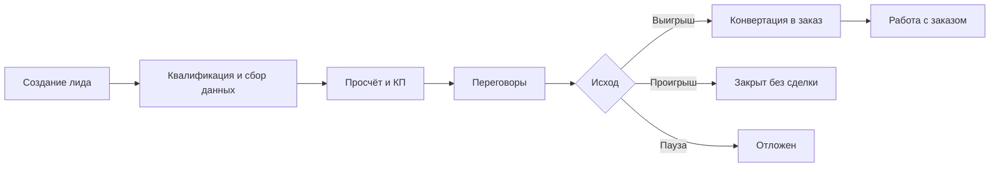

# Механизм работы лидов в CRM

Документ для менеджеров, руководителей и авторов инструкций. Описывает, **как устроен модуль «Лиды»**, какие правила действуют автоматически и что ожидается от пользователя на каждом этапе.

Краткая пошаговая инструкция: [lead-user-guide.md](./lead-user-guide.md).  
После конвертации лида: [order-wizard-user-guide.md](./order-wizard-user-guide.md).

---

## 1. Для кого и зачем

**Лид** — это входящая коммерческая возможность **до появления заказа**: звонок, заявка с сайта, запрос по e-mail, рекомендация. В CRM лид фиксирует:

- кто клиент и кто отвечает за сделку;
- что именно просят перевезти и на каких условиях;
- на каком этапе переговоров вы находитесь;
- что уже сделано (КП, звонки, письма) и что нужно сделать дальше.

Когда сделка состоялась, лид **конвертируется в заказ** — дальше работа идёт в мастере заказа.

---

## 2. Жизненный цикл лида

**Открытый лид** — любой, кроме «Выигран», «Закрыт без сделки» и (условно) «Отложен», если по нему не ведётся активная работа.

---

## 3. Два независимых слоя учёта

На одной карточке лида одновременно работают **два механизма**. Их не нужно путать.

| | **Статус лида** | **Бизнес-процесс (воронка)** |
| --- | --- | --- |
| **Где видно** | Полоска этапов вверху вкладки «Основное» | Блок процесса под полоской статусов |
| **Кто настраивает** | Фиксированный набор этапов воронки продаж | Администратор в **Настройки → Бизнес-процессы** |
| **Смысл** | Общая стадия сделки для отчётов и реестра | Конкретный регламент: цель этапа, SLA, чек-лист, скрипт |
| **Сроки** | Нет встроенного SLA | Норматив дней на этапе, дата «срок этапа», просрочка |
| **Задачи** | Только вручную («Следующий шаг») | Могут создаваться **автоматически** при входе на этап |
| **Типичное действие** | Клик по этапу воронки или автопродвижение при сохранении | «Перейти» на следующий этап процесса |

**Практическое правило для менеджера:**  
статус отвечает на вопрос «на какой мы стадии продажи в целом»; бизнес-процесс — «что именно нужно сделать **сейчас** по регламенту компании».

Если бизнес-процессы в системе не включены, остаётся только слой **статуса** и блок **«Сейчас»** (см. ниже).

---

## 4. Статусы лида (воронка)

Полоска в карточке лида:

| Статус в интерфейсе | Когда ставить / что означает |
| --- | --- |
| **Новый** | Лид только создан, детали не собраны |
| **Сбор деталей** (в реестре — **«Квалификация»**) | Уточняем запрос, клиента, условия |
| **Просчёт** | Есть маршрут и груз — можно считать ставку |
| **КП готово** | Подготовлен черновик коммерческого предложения |
| **КП отправлено** | КП ушло клиенту (часто автоматически после отправки письма) |
| **Переговоры** | Обсуждаем условия после КП |

**Исходы** (отдельный выбор в конце полоски):

| Исход | Смысл |
| --- | --- |
| **Выигран** | Сделка состоялась; обычно после конвертации в заказ |
| **Закрыт без сделки** | Лид проигран; указывают причину |
| **Отложен** | Временно не работаем; можно вернуться позже |

### Автоматическое продвижение статуса

При **сохранении** лида система может сдвинуть статус **только вперёд**, не назад:

- заполнены **маршрут** (хотя бы адрес точки) и **груз** (хотя бы наименование) → не ниже **Просчёт**;
- указана **цена клиента** → не ниже **КП готово**.

Закрытые и отложенные статусы автоматикой **не меняются**.

Дополнительно статус меняется при явных действиях:

- создание черновика КП → **КП готово**;
- отправка КП по e-mail → **КП отправлено** (если до этого было «КП готово»);
- конвертация в заказ → **Выигран**;
- переход на **терминальный этап** бизнес-процесса → **Выигран** или **Закрыт без сделки** (по настройке этапа).

---

## 5. Бизнес-процесс на лиде

Настраивается в **Настройки → Бизнес-процессы**. Для компании может быть несколько процессов (например, «Разовая перевозка» и «Контракт»).

### На этапе задаётся

- **название и порядок**;
- **цель этапа** — одна фраза, что нужно достичь;
- **playbook** — чек-лист действий менеджера;
- **критерии готовности** — когда этап можно считать завершённым;
- **норматив, дней** — SLA этапа; при превышении лид помечается как просроченный;
- **скрипт продаж** — кнопка «Открыть скрипт» на карточке;
- **автозадача** — задача при входе на этап (шаблон названия, срок, приоритет);
- **напоминания (nudges)** — см. раздел 8.

### В карточке лида

1. При **создании** выбирается **процесс** (если процессов несколько).
2. После сохранения лид встаёт на **первый этап**.
3. Для перехода: выбрать этап в списке → **Перейти**.
4. На **финальном этапе** система запросит **причину закрытия** (структурированный флаг) — это нужно для аналитики «почему не выигрываем».

В реестре лидов доступны колонки: процесс, текущий этап, срок этапа, признак просрочки.

---

## 6. Блок «Сейчас»

Компактная панель на вкладке «Основное» — **операционная подсказка**, что делать по этому лиду в данный момент.

Показывает:

- **цель текущего этапа** бизнес-процесса (если есть);
- **краткое резюме** ситуации;
- **приоритетные действия** — ссылки на нужную вкладку (маршрут, груз, коммерция и т.д.) или на блок «Следующий шаг»;
- **риски** (просрочка этапа, нет ответа на КП, пустая квалификация и т.п.);
- **что уже хорошо** (контрагент выбран, маршрут есть, КП отправлено…).

Под спойлером **«Подробнее по этапу»** — полный playbook, критерии готовности и скрипт.

Блок не заменяет бизнес-процесс: он **сводит** статус, этап, данные карточки и просрочки в один понятный список действий.

---

## 7. Реестр лидов и «Требует внимания»

### Реестр

- Раздел **Лиды** в меню → таблица с фильтрами, быстрым поиском, **сохранёнными представлениями** (grid views) и настройкой **плотности** строк.
- **Двойной клик** по строке — карточка лида **в модальном окне** поверх реестра.
- **Добавить** — новый лид в том же модальном окне.
- **Inline-редактирование** (если разрешено): статус, источник, ответственный — без открытия карточки.
- **Массовые действия** по выделенным строкам: смена статуса, источника, ответственного, удаление.
- **Контекстное меню** (ПКМ): открыть, создать на основании, удалить.

Видимость: по роли пользователь видит **только свои** лиды или **все** (настраивается в роли). Для руководителей с department scope видимость может ограничиваться отделом.

### Панель «Требует внимания»

На странице **Лиды** и на **Дашборде** (если есть открытые сигналы) показывается список лидов, по которым сработали **правила напоминаний** (см. раздел 8). У каждого лида — чипы с причинами. Клик открывает карточку.

### Outcome Intelligence (если включено)

На списке лидов (когда карточка закрыта) может отображаться блок коучинга по **закрытым** сделкам за период (win rate, типичные ошибки, возражения). Это аналитика для обучения, не очередь текущих действий.

### Действия в шапке карточки

После первого сохранения лида в шапке доступны:

| Кнопка | Условие |
| --- | --- |
| **На биржу** | Область `load_board`; открывает модуль биржи с контекстом `from_lead` |
| **Сколько влезет?** | Область `modules_how_much_fits` или `modules`; калькулятор загрузки с данными лида |
| **Конвертировать в заказ** | Выбран контрагент; создаёт или открывает связанный заказ |

---

## 8. Напоминания (nudges) и задачи

Раз в сутки (по расписанию сервера) система проверяет открытые лиды и при необходимости **создаёт задачи** ответственному менеджеру. Повторно одна и та же задача не дублируется, пока не закрыта.

| Тип напоминания | Когда срабатывает |
| --- | --- |
| **Нет ответа на исходящее письмо** | КП или письмо отправлено, входящего ответа нет дольше порога (по умолчанию 3 дня, на этапе БП можно задать свой) |
| **Просрочен этап воронки** | Лид дольше норматива (`норматив, дней`) на текущем этапе бизнес-процесса |
| **Пропущен следующий контакт** | Дата поля **Следующий контакт** прошла |
| **Нет активности в ленте** | На этапе нет событий в **Коммуникациях** (письма, смена этапа, заметки…) дольше заданного числа дней — только если включено на этапе |

Какие типы включены на этапе, настраивает администратор в **Настройки → Бизнес-процессы → этап → Напоминания (nudges)**.

---

## 9. Вкладки карточки лида

Набор вкладок определяется **профилем бизнес-процесса** (`default` или `contract-signing`).

### Стандартный профиль (`default`)

| Вкладка | Назначение |
| --- | --- |
| **Основное** | Статус, процесс, «Сейчас», клиент, квалификация, следующий контакт, следующий шаг |
| **Маршрут** | **Плечи** перевозки: точки погрузки/выгрузки, перевозчики и ориентиры по ставке на плечо |
| **Груз** | Позиции: наименование, вес, объём, упаковка, ТН ВЭД, опасный груз |
| **Предрасчёт** | Импорт / параллельный ввоз: товарные строки, услуги, таможня, итог; документ HTML/PDF |
| **Финансы** | Цена для клиента, формы и условия оплаты клиента и перевозчика, ориентир по марже |
| **Документы** | Вложения к лиду (сканы, спецификации, переписка в файлах) |
| **Коммуникации** | Звонки, встречи, заметки и **лента событий** (смена этапа, КП, письма…) |
| **Коммерческое** | Шаблоны КП (DOCX и HTML), предпросмотр, отправка по e-mail, история КП |

### Профиль «Подписание договора» (`contract-signing`)

Только **Основное**, **Документы**, **Коммуникации** — без маршрута, груза, предрасчёта, финансов и коммерции.

Вкладки **Коммерческое**, **Документы**, **Предрасчёт** и часть действий доступны только у **уже сохранённого** лида.

---

## 10. Вкладка «Основное» — поля и логика

### Суть сделки

- **Тема** — обязательна, уникальна среди всех лидов (краткое название сделки).
- **Описание** — свободный текст запроса.
- **Источник** — откуда пришёл лид.
- **Тип перевозки** — FTL, LTL и т.д.

### Клиент

- Поиск контрагента от **2 символов** (название, ИНН, телефон, e-mail).
- **Новый контрагент** — быстрое создание из карточки (минимум — название).
- При выборе существующего контрагента поле **ЛПР — кто принимает решение** подставляется из карточки контрагента (контакт ЛПР → основной контакт → контактное лицо → подписант). Вручную введённое значение не перезаписывается.

### Квалификация

В интерфейсе карточки отображаются два поля:

| Поле | Зачем |
| --- | --- |
| **ЛПР** (`authority`) | Кто принимает решение |
| **Бюджет** | Ориентир по сумме |

Поля «потребность» и «срок» могут храниться в данных лида (API, интеграции), но **отдельных полей в форме нет** — фиксируйте их в описании или в блоке «Сейчас» / playbook этапа.

Кнопка **«Перенести ЛПР и бюджет в портрет»** (если контрагент выбран) копирует квалификацию в **портрет контрагента** без перезаписи уже заполненных полей портрета.

### Портрет клиента

Если у контрагента портрет заполнен менее чем наполовину, показывается предупреждение со ссылкой на вкладку **Портрет** в карточке контрагента.

### Следующий контакт и следующий шаг

- **Следующий контакт** — дата/время планового касания (поле `next_contact_at`); в карточке не редактируется — смотрите колонку **След. контакт** в гриде; при просрочке может сработать напоминание.
- **Следующий шаг** — создание **задачи** по лиду (название, срок, ответственный). Если указан срок задачи, обновляется «Следующий контакт». Нужен доступ к модулю **Задачи**.

### Закрытие без сделки

При статусе **Закрыт без сделки** или при переходе на проигрышный этап процесса указывают **структурированную причину** (флаг) и при необходимости комментарий. Открытые задачи по лиду могут быть автоматически отменены; система предложит создать задачу «на будущее» для поддержания контакта.

---

## 11. Маршрут, груз, финансы

### Маршрут и плечи

- Маршрут строится из **плеч** (`leg_1`, `leg_2`, …): у каждого плеча свои точки (погрузка / выгрузка / промежуточная) с адресом, плановой датой и контактом на точке.
- На плечо можно указать **перевозчика** и **ориентир по ставке** — они переносятся в заказ при конвертации (блок `performers` → исполнители заказа).
- Кнопки **добавить / удалить плечо** синхронизируют точки маршрута с плечами.
- При сохранении в лид подставляются сводные поля «откуда / куда» для реестра и печатных форм.

### Предрасчёт (вкладка)

Для сделок с импортом и параллельным ввозом:

- **Товарные строки** — наименование, ТН ВЭД (поиск по справочнику), количество, цена в валюте инвойса.
- **Услуги** — логистика до/после границы; кнопка **«Подтянуть из плеч»** создаёт строки из перевозчиков маршрута.
- **Распределение фрахта** — между товарными строками по выбранной базе.
- **Итог** — таможенная стоимость, пошлина, НДС, утильсбор, доставка; кнопка **«Применить к финансам»** переносит grand total в цену клиента.
- **Документ** — предпросмотр HTML/PDF расчёта из карточки.
- При **конвертации** снимок `precalculation` сохраняется в метаданных заказа (`lead_precalculation_snapshot`).

### Груз

- Одна или несколько позиций. Для просчёта важны наименование, вес, объём; объём можно вводить с **запятой** (например, `1,5` м³).
- При заполненных габаритах объём может пересчитываться автоматически.

### Финансы

- **Цена клиента** и валюта — переносятся в заказ при конвертации; влияют на автостатус «КП готово».
- **Формы оплаты** клиента и перевозчика — справочники из системы.
- **Ориентир по марже** — для внутренней оценки сделки.

---

## 12. Коммуникации и лента событий

Вкладка **Коммуникации** объединяет:

- ручные записи (звонок, встреча, заметка);
- **автоматические события**: смена этапа процесса, подготовка и отправка КП, исходящие и входящие письма (если настроена синхронизация почты), создание задач, смена статуса.

Лента важна для напоминания **«Нет активности»**: если менеджер долго не фиксирует контакт, система может создать задачу.

Письма, не привязанные автоматически, можно вручную связать с лидом в модуле **Почта**.

---

## 13. Коммерческое предложение

### DOCX (классические шаблоны)

1. Шаблоны настраиваются в **Настройки → Шаблоны печати** (сущность: лид, группа: коммерческие).
2. На вкладке **Коммерческое** — выбор шаблона → **Создать в карточке** → черновик DOCX.
3. Предпросмотр и скачивание из списка форм.
4. **Отправить по e-mail** — письмо с вложением; получатели из e-mail контрагента.

### HTML-шаблоны КП

- Редактор в **Модули → Шаблоны КП** (визуальный конструктор).
- На вкладке **Коммерческое** — выбор HTML-шаблона, предпросмотр, PDF, отправка тем же почтовым механизмом.

### История

Справа на вкладке — список подготовленных КП по лиду со статусами (в т.ч. отправлено).

---

## 14. Конвертация в заказ

**Условие:** лид сохранён, выбран **контрагент**.

1. Кнопка **Конвертировать в заказ** в шапке карточки.
2. Создаётся **новый заказ** (или открывается уже существующий, если конвертация была раньше — один лид → один заказ).
3. **Переносится:**
   - контрагент, даты, примечания;
   - **маршрут** (точки с привязкой к плечам);
   - **груз**;
   - **исполнители** из перевозчиков по плечам (`performers` → `contractors_costs` в финансовых условиях);
   - цена клиента, валюта, формы оплаты;
   - **снимок предрасчёта** (если заполнен).
4. Статус лида → **Выигран**; в ленту пишется событие конвертации; открывается **мастер заказа**.
5. Если КП в системе ещё не было — может быть создана запись оффера «КП-{номер лида}» для истории.

Без контрагента кнопка неактивна.

---

## 15. Связь с другими модулями

| Модуль | Связь с лидом |
| --- | --- |
| **Задачи** | Задачи с привязкой к лиду; смена статуса **открытой** задачи может сдвинуть статус лида (`new` → «Новый», `in_progress` → «Квалификация», `review` → «Переговоры», `on_hold` → «Отложен»). **Завершение задачи (`done`) и отмена (`cancelled`) статус лида не меняют** — выигрыш только через конвертацию или явный исход. См. [tasks-user-guide.md](./tasks-user-guide.md) |
| **Контрагенты** | Клиент лида; портрет, контакты, ЛПР |
| **Почта** | Отправка КП; синхронизация переписки в ленту |
| **Канбан** | Карточки задач по лиду (см. [kanban-user-guide.md](./kanban-user-guide.md)) |
| **Заказы** | Один лид → один или ноль заказов (`orders.lead_id`) |
| **Скрипты продаж** | Привязка скрипта к этапу бизнес-процесса |
| **AI-ассистент** | Может запросить операционный бриф по лиду (для внутреннего использования) |

Лид можно создать **из задачи** (если в задаче указан контекст) — поля и ответственный подставляются.

---

## 16. Права и видимость

| Настройка роли | Эффект |
| --- | --- |
| Область **«Лиды»** | Доступ к разделу |
| Видимость **свои / все** | Чужие лиды в реестре |
| Назначение ответственного | Смена ответственного на чужом лиде |
| **Задачи** | Блок «Следующий шаг» |
| **Почта** | Отправка КП (достаточно также области «Лиды» для базового сценария) |
| **Настройки системы** | Настройка бизнес-процессов и напоминаний |

---

## 17. Типовые сценарии

### Входящий звонок

1. **Добавить** лид → тема + контрагент (или новый).
2. **Сохранить**.
3. **Следующий шаг** — задача «Перезвонить» со сроком.

### Расчёт и КП

1. Заполнить **Маршрут** (плечи + точки) и **Груз** (статус поднимется до «Просчёт»).
2. Указать **цену** на «Финансы» или через **Предрасчёт** → «Применить к финансам».
3. **Коммерческое** → шаблон → черновик → отправить по e-mail.

### Импорт / параллельный ввоз

1. **Маршрут** — плечи и перевозчики.
2. **Предрасчёт** — товарные строки, услуги, расчёт таможни.
3. **Финансы** — проверить цену после «Применить к финансам».
4. **Коммерческое** — КП с итоговой суммой.

### Выигрыш

1. **Конвертировать в заказ**.
2. Дозаполнить мастер заказа (перевозчик, документы, график оплат).

### Проигрыш

1. Статус **Закрыт без сделки** или финальный этап процесса с исходом «проигран».
2. Указать **причину закрытия** (флаг + комментарий).

### Просроченный этап

1. Проверить блок **«Сейчас»** и панель **«Требует внимания»**.
2. Выполнить действия или перевести лид на следующий этап / закрыть с причиной.

---

## 18. Частые вопросы

**Не сохраняется лид.**  
Проверьте уникальность **темы**, поле **ответственный**, выбор **процесса** (если процессы обязательны), условные поля маршрута/груза при частичном заполнении.

**Статус изменился сам.**  
Сработало автопродвижение при сохранении или действие с КП/заказом — см. раздел 4.

**Два разных «этапа» в карточке.**  
Это нормально: **статус** (воронка) и **этап бизнес-процесса** (регламент) — разные слои.

**Нет вкладки «Коммерческое».**  
Сначала сохраните лид.

**Кнопка «Конвертировать» неактивна.**  
Выберите контрагента.

**Не вижу чужие лиды.**  
У роли видимость «только свои».

**Пришла задача «Нет ответа на КП».**  
Клиент не ответил на письмо дольше порога — перезвоните или напишите снова.

**ЛПР подставился не тот.**  
Исправьте вручную или обновите контакт ЛПР в карточке контрагента.

**Нет вкладки «Маршрут» или «Предрасчёт».**  
Проверьте бизнес-процесс: профиль «Подписание договора» (`contract-signing`) показывает только Основное, Документы и Коммуникации.

**Карточка открывается в окне, а не на отдельной странице.**  
Так задумано: реестр остаётся на фоне, двойной клик открывает модальное окно с мастером лида.

---

## 19. Для администратора (кратко)

- **Бизнес-процессы:** этапы, SLA, playbook, автозадачи, nudges — **Настройки → Бизнес-процессы**.
- **Шаблоны КП:** печать (DOCX) и HTML-модуль.
- **Роли:** области `leads`, `tasks`, `mail`, видимость своих/всех лидов.
- **Cron на сервере:** команда `commercial:process-nudges` (обычно раз в сутки) для создания задач-напоминаний.

---

## 20. Связанные документы

| Документ | Содержание |
| --- | --- |
| [lead-user-guide.md](./lead-user-guide.md) | Краткая инструкция по шагам |
| [tasks-user-guide.md](./tasks-user-guide.md) | Задачи и связь с лидами |
| [order-wizard-user-guide.md](./order-wizard-user-guide.md) | После конвертации |
| [commercial-intelligence-phase-0-1.md](./commercial-intelligence-phase-0-1.md) | Лента, почта, КП (техническая выжимка) |
| [tz-step-01-portrait-mvp.md](./tz-step-01-portrait-mvp.md) | Портрет контрагента из лида |

*Актуально на июль 2026. При изменении интерфейса обновляйте этот файл, [lead-user-guide.md](./lead-user-guide.md) и статью «Лиды — инструкция для пользователя» в Книге продаж.*
