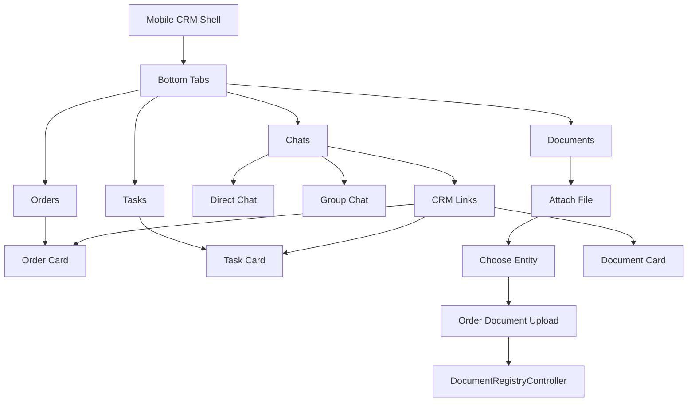

# Mobile CRM Messenger Redesign Plan

## Контекст

Текущий checkpoint мессенджера зафиксирован commit `9afe206` и tag `messenger-mobile-checkpoint-20260704`. Это рабочая точка возврата: APK открывает `/mobile/messenger`, mobile UI показывает список чатов с переходом в thread, CRM desktop панель работает как split-view.

Дальше не стоит делать мелкий v2 поверх текущего экрана отдельно. Идея пользователя шире: превратить мессенджер в мобильную CRM-оболочку для менеджера. Нижняя навигация приложения: `Чаты / Документы / Заказы / Задачи`; связующим слоем между модулями становятся чаты и общие ссылки на CRM-сущности.

## Что уже есть

- `MessengerController` и `MessengerService` уже поддерживают direct/group conversations, unread, mark read, отправку сообщений, document chips.
- `MessengerController::colleagues()` сейчас отдаёт `id`, `name`, `email`; в БД есть `users.phone`, поэтому телефон и `tel:`-действие можно добавить без новой схемы.
- `DocumentRegistryController::store()` умеет JSON-ответ при `expectsJson()` и уже сохраняет файл как `OrderDocument` через `DocumentStorageService`.
- `StoreDocumentRegistryRequest` уже валидирует `order_id`, `party`, `type`, `status`, `file`, `requirement_slot_key`, включая `DocumentWithinPageBudget`.
- Inertia v2 поддерживает file upload через `FormData` и progress; для мобильного контура можно использовать либо Inertia form, либо `axios`/`fetch` с `multipart/form-data`.
- CRM shell уже имеет mobile app shell и bottom nav в `CrmLayout.vue`, но текущий APK-мессенджер лучше оставить отдельной оболочкой, чтобы не тащить гриды на телефон.

## Цель

Сделать мобильное приложение не "маленькой CRM с гридами", а рабочим assistant-shell:

- общение с коллегами в direct/group чатах;
- быстрый звонок по телефону коллеги;
- вставка ссылок на заказ, заявку, документ, контрагента;
- приём файла с телефона и прикрепление к нужной сущности;
- загрузка документа в заказ с выбором слота/стороны/типа;
- быстрые карточки вместо таблиц: "мои заказы", "документы требуют действия", "последние сущности";
- нижние вкладки `Чаты`, `Документы`, `Заказы`, `Задачи`, где каждый раздел работает со своим модулем без AG Grid.

## Предлагаемая архитектура

### Backend слой

1. Расширить messenger API без ломки текущих routes:
   - `colleagues`: добавить `phone`, возможно `position`/`role`;
   - добавить mobile-friendly endpoint для поиска сущностей: orders, documents, contractors, leads;
   - добавить endpoint "link chip catalog" как обобщение текущего `documentChips`;
   - оставить существующий `documents.store` для загрузки, но сделать mobile wrapper, если нужна более удобная выдача слотов.

2. Для файлов:
   - не хранить файлы как изолированные chat attachments на первом этапе;
   - файл сначала проходит CRM-путь: выбрать сущность/заказ/слот, сохранить в storage и БД по принципу реестра `Документы`;
   - после успешного сохранения отправлять в чат карточку/ссылку на уже созданный документ или заказ.

3. Для документов заказа:
   - использовать существующий `DocumentRegistryController::store()`;
   - переиспользовать `StoreDocumentRegistryRequest`, `DocumentWithinPageBudget`, `DocumentStorageService`;
   - добавить mobile endpoint для подсказок по слотам документа заказа, чтобы пользователь не выбирал "тип/сторона" вслепую.

### Frontend слой

1. Разделить mobile приложение на shell-состояния:
   - `tab:chats`;
   - `tab:documents`;
   - `tab:orders`;
   - `tab:tasks`;
   - `chats`;
   - `thread`;
   - `newGroup`;
   - `entityPicker`;
   - `attachToEntity`;
   - `orderDocumentUpload`;
   - `entityCard`.

2. В thread composer добавить action sheet:
   - "Ссылка на заказ";
   - "Ссылка на документ";
   - "Прикрепить файл к заказу";
   - "Создать групповой чат";
   - позже: "Задача", "Заметка", "Позвонить".

3. Список контактов:
   - убрать крупный брендовый заголовок;
   - unread показывать badge/счётчиком в строке конкретного диалога, как в Telegram;
   - общий unread в header не показывать; общий счётчик может жить только на нижней вкладке `Чаты`;
   - refresh заменить на pull-to-refresh или маленькую иконку;
   - вместо email показывать `phone`;
   - телефон делать `tel:${phone}`;
   - если телефона нет, показывать роль/почту вторым приоритетом.

## Фазы реализации

### Фаза 1. Mobile shell and messenger baseline

- Ввести нижнюю навигацию `Чаты / Документы / Заказы / Задачи`, где первой активной вкладкой остаются `Чаты`.
- Убрать заголовок "Автоальянс Чат" и текст "все сообщения прочитаны".
- Сверху оставить компактную строку: поиск + menu; общий unread вынести в badge вкладки `Чаты`, per-chat unread оставить в строках диалогов.
- Добавить mobile UI создания группового чата поверх уже существующего `conversations.groups.store`.
- `colleagues()` возвращает `phone`; в списке показывать телефон и кнопку звонка.
- Переиспользовать document chips в mobile thread action sheet, не убирая их из desktop CRM-панели.

Проверка: mobile list, direct thread, group creation, `tel:` link, вставка document chip в сообщение.

### Фаза 2. Mobile Documents / Orders / Tasks tabs

- `Документы`: карточный inbox без грида: "добавить документ", "требуют действия", "последние".
- `Заказы`: карточки заказов с быстрым просмотром статуса, маршрута, контрагентов и документов.
- `Задачи`: мои задачи, просроченные, задачи по заказу/лиду, быстрый переход в связанный чат/заказ.
- Все вкладки должны уметь отправить ссылку/карточку сущности в чат.

Проверка: переходы между вкладками, карточки без AG Grid, открытие связанного чата/заказа.

### Фаза 3. Mobile CRM links

- Обобщить document chips в entity chips:
  - order;
  - order document;
  - contractor;
  - lead.
- Добавить mobile entity picker с поиском по номеру заказа/id/названию.
- В сообщении хранить пока обычный текст + URL, без новой схемы metadata.
- Отрисовку ссылок сделать как preview-card на фронте, распознавая URL/route.

Проверка: отправить "прошу сделать счёт по заявке ..." + ссылка на заказ/документ, открыть ссылку из APK.

### Фаза 4. Attach file to CRM entity

- Добавить mobile flow "Прикрепить файл":
  - выбрать файл;
  - выбрать сущность;
  - выбрать тип/сторону/слот;
  - загрузить через `documents.store` или mobile wrapper;
  - после успеха отправить в thread сообщение со ссылкой на документ/заказ.
- Для заказа использовать existing document budget estimation и `DocumentWithinPageBudget`.
- Не добавлять binary attachment к chat message до появления явного сценария "файл только в чат"; основной сценарий — файл мигрирует в CRM-документы.

Проверка: файл из телефона попал в `order_documents`, виден в заказе/реестре, в чат отправлена ссылка.

### Фаза 5. Mobile CRM cards without grids

- Сделать карточные экраны:
  - мои активные заказы;
  - документы требуют действия;
  - последние открытые сущности;
  - быстрый поиск.
- Переиспользовать access rules `RoleAccess` и существующие scopes.
- Не пытаться переносить AG Grid на mobile; только cards + detail screens.

## Риски

- Документы заказа сложнее простого upload: важны `party`, `type`, `requirement_slot_key`, carrier slot, contractor id, этап плеча.
- Если пользователь добавляет файл из чата, он всё равно сначала становится CRM-документом/вложением сущности, а чат получает ссылку. Это снижает риск расхождения файлового хранилища и реестра документов.
- Для push/ntfy надо отдельно решить, как уведомлять о CRM-действиях из чата, чтобы не плодить шум.
- Prod APK грузит frontend с `crm.avtoaliyans.ru`; любые mobile UI изменения видны после deploy `public/build`.

## Рекомендуемый следующий шаг

Начать с фазы 1: каркас нижних вкладок и доведение вкладки `Чаты` до нормального mobile messenger UX. Затем добавить карточный минимум для `Документы / Заказы / Задачи`, не перенося AG Grid на телефон.
