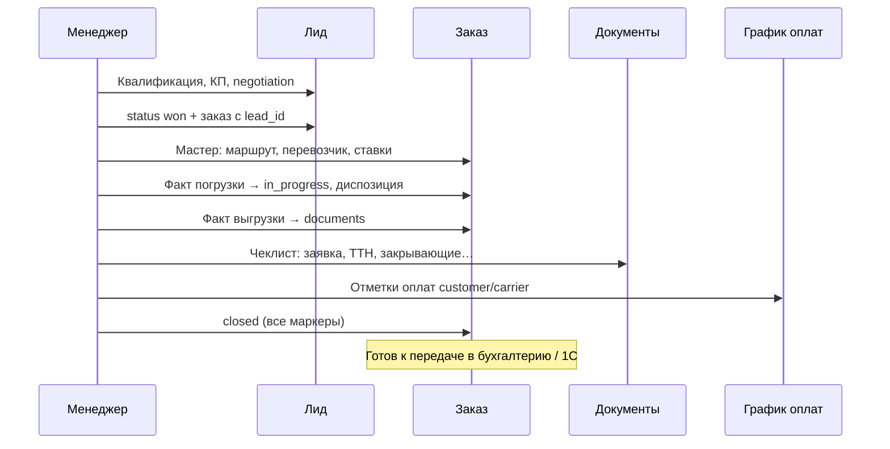
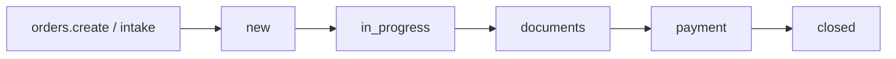

# Workflow end-to-end — spike (фаза 5)

**Дата:** 2026-06-03  
**Статус:** черновик для согласования  
**Связано:** [`roadmap-2026.md`](./roadmap-2026.md) § фаза 5, [`commercial-intelligence-roadmap.md`](./commercial-intelligence-roadmap.md) § 8.3

**Цель spike:** понять, как показать руководителю сквозной путь «лид → заказ → документы → финансы → закрыт» **без** дублирования уже существующих статусов и без тяжёлого BPM-движка.

---

## 1. Карта статусов (как есть в коде)

### 1.1 Лид (`leads`)

| Слой | Источник | Значения / смысл |
|------|----------|------------------|
| **Воронка CRM** | `LeadStatus` | `new` → `qualification` → `calculation` → `proposal_ready` → `proposal_sent` → `negotiation` → `won` \| `lost` \| `on_hold` |
| **Бизнес-процесс** | `business_processes` + `business_process_stages` | Настраиваемые этапы на лиде (`business_process_id`, `business_process_stage_id`), лог `lead_process_stage_logs`, playbook-задачи на этапе |
| **Связь с заказом** | `orders.lead_id` | Обратная связь: заказ знает лид; у лида прямого `order_id` нет |

**Терминальные исходы лида:** `won` (конвертирован), `lost`, `on_hold`.

### 1.2 Заказ (`orders`)

| Слой | Источник | Значения / смысл |
|------|----------|------------------|
| **Вычисляемый статус** | `OrderStatusService` | `new` → `in_progress` (факт погрузки) → `documents` (факт выгрузки, не все доки) → `payment` (доки ок, не все оплаты) → `closed` |
| **Исключения** | `manual_status` / запрос | `cancelled`, `disruption` |
| **Факты маршрута** | `route_points.actual_date` / performers | Погрузка / выгрузка — драйверы статуса и диспозиции «в пути» |
| **Диспозиция** | `disposition_entries` | Параллельный слой: местоположение по дням, не меняет `status` |

**Закрытие заказа (`closed`):** факт выгрузки + чеклист обязательных документов + оплата заказчик / перевозчик / менеджер (`payment_statuses`, `salary_paid`).

### 1.3 Документы (`order_documents`)

| Слой | Источник | Значения |
|------|----------|----------|
| **Реестр / загрузка** | `order_documents.status` | `draft`, `pending`, `signed`, `sent`, … |
| **Печатная форма (workflow)** | `OrderDocumentWorkflowStatus` | `draft` → `pending_approval` → `approved` → `rejected` → `finalized` (PDF) |
| **Чеклист заказа** | `OrderDocumentRequirementService` | Правила слотов (заказчик / перевозчик / плечо) → `completed: bool` по каждому пункту |

Для сквозного pipeline важен **чеклист** (все обязательные пункты закрыты), а не только workflow одной печатной формы.

### 1.4 Финансы

| Слой | Источник | Значения |
|------|----------|----------|
| **График оплат** | `payment_schedules` | `pending`, `paid`, `overdue`, `cancelled` (+ частичные через `parent_payment_id`) |
| **Маркеры на заказе** | `orders.payment_statuses` (JSON) | `customer` / `carrier` / `manager` — paid-флаги для `OrderStatusService` |
| **KPI / мотивация** | `kpi_deduction_rules`, считалка маржи | После закрытия сделки; не блокирует статус `closed` |

### 1.5 «Сдан в отчёт / налоговая» (целевой конец pipeline)

В коде **нет отдельного статуса** «сдан в налоговую». На практике это **внешний контур** (1С Fresh / ЭТрН / бухгалтерия):

| Уровень | Критерий «готово для учёта» |
|---------|----------------------------|
| **MVP в CRM** | `OrderStatusService` → `closed` + нет просроченных `payment_schedules` + чеклист документов 100% |
| **Расширение** | Флаг `accounting_exported_at` или интеграция 1С: документ выгружен / проведён |
| **Не в scope spike** | Полный налоговый календарь, декларации |

---

## 2. Три сценария до «готов к учёту»

### Сценарий A — Стандартная перевозка (лид → заказ → закрытие)



**Узкие места:** ожидание сканов от перевозчика, согласование печатной заявки (`pending_approval`), просрочка оплаты по графику.

### Сценарий B — Заказ без лида (прямой вход)



**Особенность:** колонка «Лид» в сквозном канбане пустая; pipeline начинается с «Новый заказ». Связь `lead_id = null`.

### Сценарий C — Срыв / отмена

| Точка | Действие | Итог в pipeline |
|-------|----------|-----------------|
| На лиде | `lost` | Терминал воронки, заказа нет |
| На заказе | `disruption` / `cancelled` | Отдельная колонка «Срыв»; диспозиция и напоминания отключаются |
| Документы | `rejected` в print workflow | Возврат в `draft`, заказ остаётся в `documents` |
| Финансы | `cancelled` в графике | Заказ может остаться в `payment` до ручного закрытия |

---

## 3. Решение: `business_processes` vs `ProcessInstance`

### Варианты

| Вариант | Плюсы | Минусы |
|---------|-------|--------|
| **A. Расширить `business_processes` на заказы** | Единая модель этапов, playbook как на лидах | Дублирует `OrderStatusService` (факты vs этапы); риск рассинхрона |
| **B. Новая `process_instances` (BPM)** | Гибкость, версии процессов | Высокая стоимость, миграции, UI редактора процессов |
| **C. Read-model «сквозной pipeline» (рекомендуется)** | Переиспользует текущие статусы; быстрый MVP канбана | Не заменяет настраиваемый BPM на заказах |

### Рекомендация spike: **вариант C**

1. **`business_processes` оставить для лидов** — уже работает (`LeadBusinessProcessService`, настройки в Settings).
2. **Статус заказа не переводить на BP-этапы** — оставить фактологический `OrderStatusService`.
3. Добавить сервис **`EndToEndPipelineSnapshot`** (read-only):

```php
// Псевдо-контракт (не реализовано в spike)
EndToEndPipelineSnapshot::forOrder(Order $order): array{
    pipeline_column: 'in_transit' | 'documents' | 'payment' | 'closed' | 'disruption' | ...,
    lead_summary: ?array,
    order_status: string,
    documents_percent: int,
    payments_outstanding: Money,
    blockers: list<string>,  // человекочитаемые причины «почему не closed»
}
```

4. **Опционально позже (фаза 5.2):** `orders.accounting_handoff_at` — ручной/интеграционный маркер «принято бухгалтерией» без BPM.

**Почему не ProcessInstance:** заказ уже — state machine от фактов; лид — configurable BP. Сквозной канбан = **проекция**, а не второй источник правды.

---

## 4. Wireframe — сквозной канбан для руководителя

### 4.1 Колонки MVP (7 штук + дуализм лидов)

**Лиды (колонка 1)** внутри делятся по `business_process.slug`:

- `transport-intake` — этапы перевозки (детали → расчёт → согласование → …);
- `contract-signing` — этапы контракта (документы → согласование → протокол → подписан);
- без BP — «Без процесса».

| # | Колонка UI | Правило попадания (упрощённо) |
|---|------------|-------------------------------|
| 1 | **Лиды в работе** | `lead.status` ∉ {won, lost}; подколонки = **этапы активного БП** |
| 2 | **Заказ: подготовка** | `order.status = new`, есть `lead_id` или нет |
| 3 | **В пути** | `DispositionInTransitResolver::isInTransit` |
| 4 | **Документы** | `order.status = documents` |
| 5 | **Оплаты** | `order.status = payment` или есть `overdue` в графике |
| 6 | **Закрыт** | `order.status = closed` |
| 6b | **Принято бухгалтерией** (опц.) | `closed` + `accounting_handoff_at` не null |
| 7 | **Срыв / отмена** | `cancelled`, `disruption`, `lead.lost` |

Фильтры: менеджер, период погрузки, свой/наёмный парк, просрочка этапа лида (`is_stage_overdue`).

### 4.2 Карточка в колонке

```
┌─────────────────────────────────────┐
│ З-1042 · ООО Ромашка                │
│ Москва → Казань · свой парк         │
│ Менеджер: Иванов                    │
│ ─────────────────────────────────── │
│ ⚠ Нет ТТН перевозчика (leg_1)       │
│ ○ Оплата заказчика: просрочка 3 дн. │
│ [Заказ] [Лента] [Документы]         │
└─────────────────────────────────────┘
```

`blockers` — из `OrderStatusService::describe()['messages']` + просрочки BP лида + overdue payments.

### 4.3 Раскладка страницы (wireframe)

```
┌──────────────────────────────────────────────────────────────────┐
│ Сквозной pipeline          [Менеджер ▼] [Период ▼] [🔍 поиск]   │
├────────┬────────┬────────┬────────┬────────┬────────┬────────┤
│ Лиды   │ Подгот.│ В пути │ Доки   │ Оплаты │ Закрыт │ Срыв   │
│  (12)  │  (8)   │  (24)  │  (15)  │  (9)   │  (140) │  (2)   │
│ ┌────┐ │ ┌────┐ │ ┌────┐ │        │        │        │        │
│ │card│ │ │card│ │ │card│ │  ... горизонтальный скролл / drag  │
│ └────┘ │ └────┘ │ └────┘ │        │        │        │        │
└────────┴────────┴────────┴────────┴────────┴────────┴────────┘
│ KPI: среднее время лид→заказ | лид→closed | % с просрочкой оплат │
└──────────────────────────────────────────────────────────────────┘
```

**Drag-and-drop:** только там, где есть явное действие (лид → следующий этап BP; заказ — **не** перетаскивать статус, только открыть карточку). Иначе конфликт с фактологическим статусом.

### 4.4 Маршрут в меню

`Планирование → Pipeline` или `Отчёты → Сквозной pipeline` — visibility `orders` + `reports` для руководителя.

---

## 5. План реализации после spike (фаза 5.1 — когда согласуем)

| Шаг | Объём | Оценка |
|-----|-------|--------|
| 5.1.1 | `EndToEndPipelineSnapshot` + API `GET /pipeline/board` | 3–4 дн. |
| 5.1.2 | Inertia `Pipeline/Index.vue` — канбан без DnD статусов заказа | 3–4 дн. |
| 5.1.3 | Блокеры на карточке, ссылки в заказ/лид | 1–2 дн. |
| 5.1.4 | KPI-полоска (средние сроки, из `activity_events` + дат) | 2–3 дн. |
| 5.1.5 | MCP `get_pipeline_card` / `search_pipeline` (опционально) | 1–2 дн. |

**Не в 5.1:** редактор сквозного процесса, ProcessInstance, автоматические переходы заказа по этапам BP.

---

## 6. Решения бизнеса (зафиксировано 2026-06-03)

### 6.1 «Сдан в учёт / налоговая»

Обмена с 1С **пока нет**. Достаточно:

- автоматический критерий: `order.status = closed` (доки + оплаты по `OrderStatusService`);
- **ручная галочка бухгалтера** на заказе, напр. `accounting_handoff_at` / «Принято бухгалтерией» — отдельная колонка или подстатус в pipeline после `closed`.

Интеграция 1С — не блокер MVP канбана.

### 6.2 Два бизнес-процесса на лидах (дуализм)

В БД по умолчанию два активных BP (см. миграцию `create_business_processes_tables`):

| Slug | Название | Назначение |
|------|----------|------------|
| `transport-intake` | Получение деталей по перевозке | От запроса до расчёта, согласования цены, решения по сделке |
| `contract-signing` | Подписание контракта | Новый клиент: документы, согласование, протокол разногласий |

**Сквозной pipeline для лидов** строится **от выбранного BP**, а не от одной общей воронки:

- в UI канбана — **переключатель или две под-воронки** («Перевозка» / «Контракт»), либо две колонки-группы внутри «Лиды»;
- карточка лида показывает `business_process.name` + текущий этап `business_process_stage.name`;
- лиды без `business_process_id` — отдельный bucket «Без процесса» (legacy / ручной статус).

### 6.3 `LeadStatus` vs бизнес-процесс (БП) — в чём разница

Это **два разных слоя** на одной карточке лида. В вопросе spike «BP» могло читаться как «ВР» — имелся в виду **бизнес-процесс** (`business_processes`), не «воронка» abstract.

| | **LeadStatus** (`leads.status`) | **Бизнес-процесс (БП)** (`business_process_id` + `business_process_stage_id`) |
|---|--------------------------------|-------------------------------------------------------------------------------|
| **Что это** | Общая метка воронки CRM | Настраиваемый сценарий с **этапами** в Настройках |
| **Примеры** | `new`, `proposal_sent`, `negotiation`, `won`, `lost` | «Расчёт цены», «Сбор документов», «Протокол разногласий» |
| **Сколько вариантов** | Один список на все лиды | **Два процесса** (перевозка / контракт), у каждого свои этапы |
| **Сроки и задачи** | Нет встроенных SLA по этапу | `stage_due_at`, playbook-задачи на этапе, `lead_process_stage_logs` |
| **Связь** | Терминальный этап БП может выставить `won` / `lost` (`LeadBusinessProcessService::applyTerminalOutcome`) | Менеджер двигает **этап БП**; `LeadStatus` может обновляться отдельно или автоматически |

**Аналогия:** `LeadStatus` — «на какой стадии сделка в целом»; БП — «по какому чек-листу мы идём и на каком шаге чек-листа».

**Для канбана (ответ на вопрос 3):** перетаскивание карточки лида между колонками = смена **этапа БП** (`moveLeadToStage`), **не** произвольная смена `LeadStatus`. `LeadStatus` меняется при терминале БП или вручную в карточке, но не drag'ом по произвольным колонкам воронки.

### 6.4 Права (пока без уточнения)

По умолчанию: как у заказов — `orders` scope `all` для руководителя, `own` для менеджера. Уточнить при реализации.

---

## 7. Итог spike

| Пункт roadmap | Статус |
|---------------|--------|
| Карта статусов lead / order / document / finance | ✅ §1 |
| 2–3 сценария до «налоговой» / учёта | ✅ §2 |
| Решение BP vs ProcessInstance | ✅ §3 → **read-model, не BPM** |
| Wireframe сквозного канбана | ✅ §4 |

**Следующий шаг:** реализация 5.1.1–5.1.2 с учётом §6 (галочка бухгалтера, два BP на лидах, drag = этап БП).
